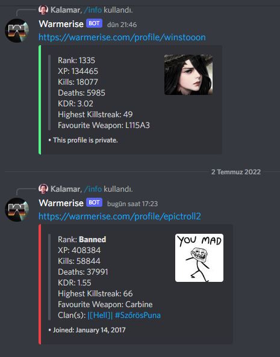

# Node.js Warmerise-Bot

An application that interacting with Discord API and display target user's profile from an external API. Made for Warmerise community discord server.
The site of game is https://warmerise.com/

The dependencies for this project;
- node-fetch
- cheerio
   
Usage:
Clone the project, get your discord bot's token and insert it to "token2" field in token.json. Do not share your discord bot's token with anyone.

Discord API ile etkilişime giren ve istenilen kullanıcının profilini harici bir API'dan çeken uygulama. Warmerise adındaki topluluk sunucusu için yapıldı. Botun işlevi istenilen kullanıcının bilgilerini gösterir.
Oyunun bağlantısı https://warmerise.com/

Bu projede kullanılan kütüphaneler:
- node-fetch
- cheerio
   
Kullanım:
Projeyi klonlayın ve token.json dosyasındaki, token2'e discord API da oluşturmuş olduğunuz botun tokenini girin. Tokeninizi kimseyle paylaşmayın.

Showcase / Ön izleme:

